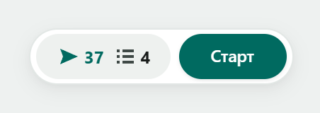
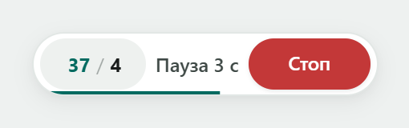
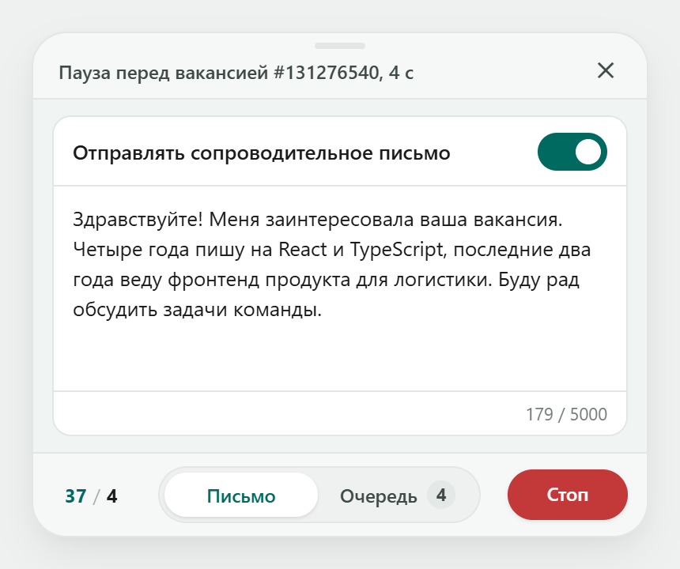
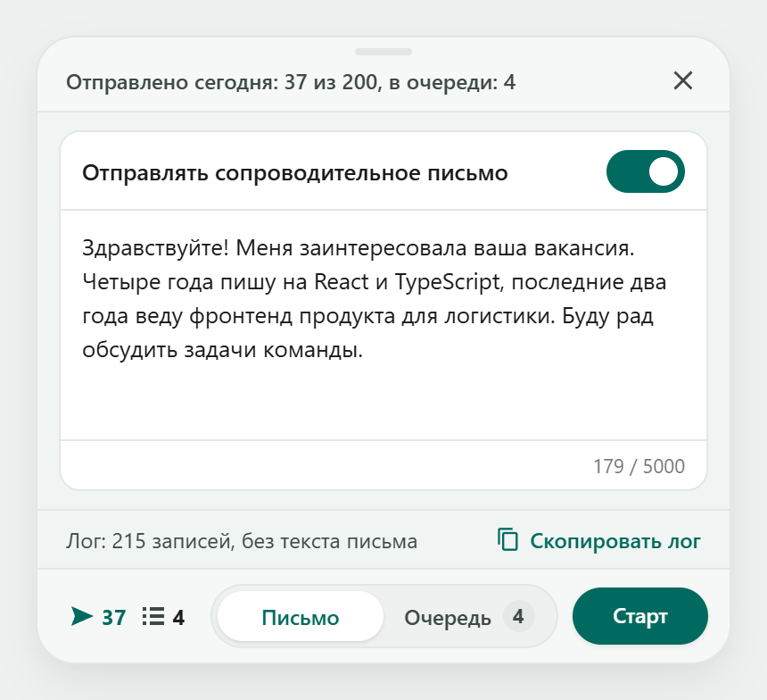
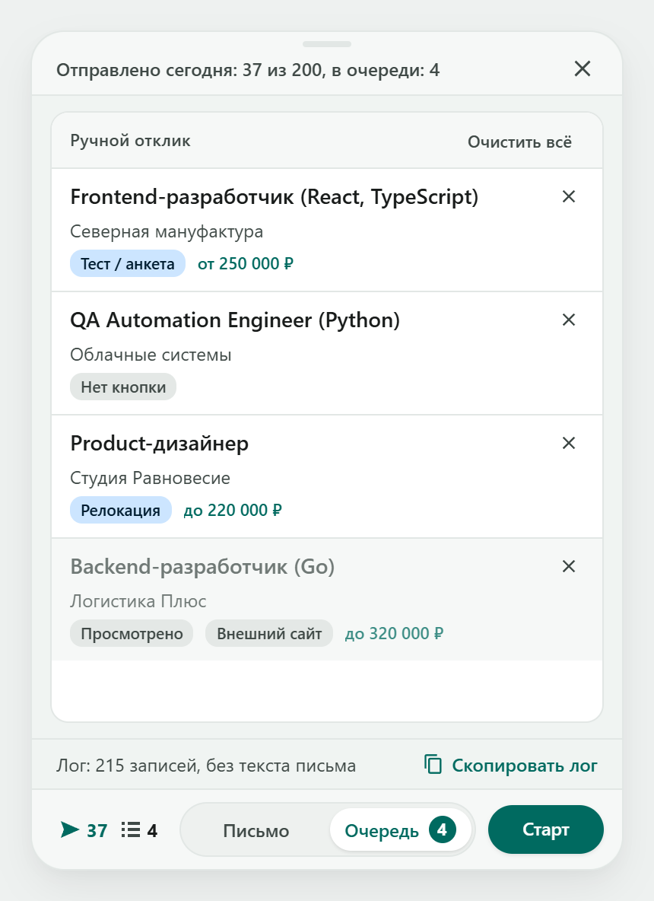
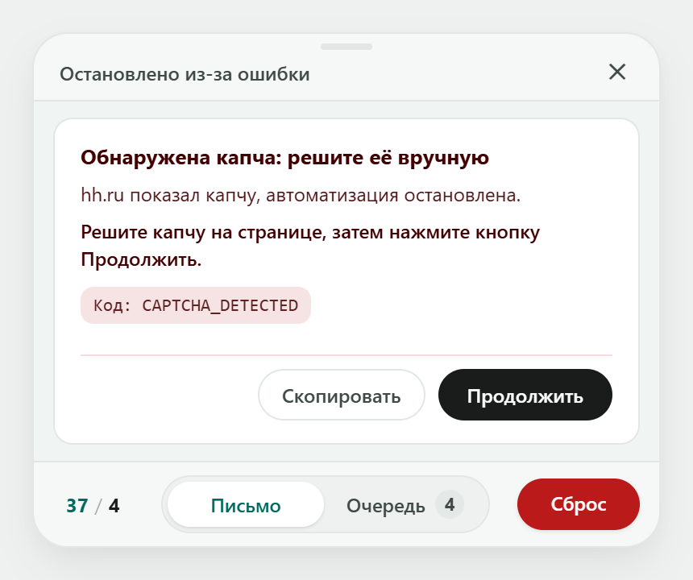

<div align="center">

# HH Apply Assistant

**Userscript для автоматизации откликов на [hh.ru](https://hh.ru)**


[](./LICENSE)

</div>

Я написал этот скрипт, чтобы не кликать вручную по сотням однотипных вакансий каждый день. Скрипт сам открывает вакансии из поиска, жмёт `Откликнуться` и возвращается в выдачу, листая страницы дальше. Если у вакансии есть тест или анкета от работодателя - он не пытается угадывать ответы, а складывает её в список `Ручной отклик`.

> [!WARNING]
> По правилам HeadHunter любая автоматизация запрещена. Автор скрипта не несёт ответственности за возможную блокировку профиля или любые другие ограничения вашего аккаунта. Подробнее - в разделе [Риски](#риски).

Внизу страницы висит плавающий виджет со счётчиком (например, `14 / 3`):
* **14** - отправлено откликов за сегодня. Счётчик считается по вашему времени, обнуляется в полночь и хранится в браузере. Лимит hh считает скользящие 24 часа, поэтому цифры могут не совпадать
* **3** - вакансий в очереди на ручной отклик

Во время работы в пилюле рядом со счётчиком виден текущий шаг (`Пауза 4 с`, `Отклик`, `Жду hh.ru`), а полоска снизу заполняется, пока идёт пауза. Если навести на счётчик, появится подсказка с расшифровкой цифр и полным описанием шага. То же описание есть в строке статуса наверху раскрытой панели, а когда скрипт не работает, там сводка за день.

<p align="center">
  
  &nbsp;&nbsp;
  
</p>

Виджет можно перетащить мышкой в удобное место, у краёв экрана он прилипает. Поднять его можно только до высоты, где над ним ещё помещается раскрытая панель.

---

## Установка

Скрипт работает на `hh.ru` через расширение Tampermonkey. Нужно три шага.

### Шаг 1. Установите Tampermonkey

* Chrome, Brave, Vivaldi, Яндекс Браузер: [Chrome Web Store](https://chromewebstore.google.com/detail/tampermonkey/dhdgffkkebhmkfjojejmpbldmpobfkfo)
* Microsoft Edge: [Microsoft Edge Add-ons](https://microsoftedge.microsoft.com/addons/detail/tampermonkey/iikmkjmpaadaobahmlepeloendndfphd)
* Mozilla Firefox: [Firefox Add-ons](https://addons.mozilla.org/ru/firefox/addon/tampermonkey/)
* Opera: [Tampermonkey Beta в каталоге Opera](https://addons.opera.com/en/extensions/details/tampermonkey-beta/)

### Шаг 2. Разрешите Tampermonkey запускать скрипты

Браузеры на Chromium требуют отдельного разрешения для пользовательских скриптов. Пока оно не включено, скрипты не запускаются, а Tampermonkey может показывать баннер про режим разработчика, даже если он уже включён.

Откройте страницу расширений из таблицы, найдите карточку Tampermonkey и нажмите `Сведения` (в некоторых браузерах `Подробнее`):

| Браузер | Страница расширений | Что включить |
|---|---|---|
| Chrome 138 и новее | `chrome://extensions` | `Разрешить пользовательские скрипты` в сведениях Tampermonkey |
| Brave | `brave://extensions` | то же самое |
| Vivaldi | `vivaldi://extensions` | то же самое |
| Edge | `edge://extensions` | то же самое. В Edge 143 и более ранних версиях этого переключателя нет, там включите `Режим разработчика` на странице расширений |
| Opera | `opera://extensions` | оба пункта: `Режим разработчика` вверху страницы и `Разрешить пользовательские скрипты` в сведениях |
| Яндекс Браузер | `browser://extensions` | `Режим разработчика` (вверху справа) и, если он есть в сведениях Tampermonkey, `Разрешить пользовательские скрипты` |
| Firefox | - | ничего, работает сразу |

Chrome 137 и более ранние версии (версия видна на `chrome://version`) вместо переключателя требует включённый `Режим разработчика` на странице расширений.

После включения перезапустите браузер или выключите и снова включите Tampermonkey.

### Шаг 3. Установите сам скрипт

[](https://raw.githubusercontent.com/tgeruzov/hh-apply-assistant/main/hh-apply-assistant.user.js)

После клика откроется вкладка Tampermonkey - нажмите кнопку `Установить`.

Проверьте установку: откройте [поиск вакансий hh.ru](https://hh.ru/search/vacancy). Внизу страницы должен появиться виджет. Если его нет, вернитесь к шагу 2.

---

## Где работает скрипт

Виджет появляется только на этих страницах hh.ru:

| Страница | Что делает |
|---|---|
| `/search/vacancy` | Основной поиск - отсюда запускается автоматизация |
| `/vacancy/<id>` | Страница вакансии - скрипт нажимает `Откликнуться` |
| `/applicant/vacancy_response` | Форма отклика и подтверждение |
| `/article/` | Промо-страницы компаний (скрипт сохраняет такие вакансии в ручную очередь) |

На других разделах hh.ru (профиль, резюме, чат, настройки) скрипт не активируется. Другие региональные домены (например, hh.kz, rabota.by) пока не поддерживаются.

---

## Как пользоваться

### Запуск и процесс работы
1. Откройте [поиск вакансий hh.ru](https://hh.ru/search/vacancy) и настройте фильтры (город, зарплату, график).
2. Нажмите кнопку `Старт` на виджете.
3. Скрипт начнёт открывать вакансии по очереди в этой же вкладке, жать отклик и возвращаться обратно. Когда страница закончится - сам перейдёт на следующую.
4. Между действиями скрипт делает паузы, имитируя человека (~10-15 секунд на вакансию).

<p align="center">
  
</p>

Скрипт остановится сам, если:
* Вы нажали `Стоп`
* Закончились вакансии в поиске
* Вылезла капча (решите её руками, затем нажмите `Продолжить` в карточке ошибки)
* Упёрлись в суточный лимит HeadHunter (до 200 откликов за 24 часа)
* hh.ru отвечает ошибкой или ограничивает доступ (429, 503, «Доступ ограничен»)
* Страница зависла, и две перезагрузки подряд не помогли
* Скрипт не нашёл кнопку отклика в выдаче (например, hh поменял вёрстку)
* Скрипт уже запущен в другой вкладке или потерял блокировку вкладки

**Держите вкладку с hh.ru активной или вынесите в отдельное окно.** Если свернуть её в фон, браузер начнёт душить фоновые таймеры. Не запускайте скрипт сразу в нескольких вкладках - сработает встроенная защита от одновременного запуска. Если случайно закрыли вкладку, откройте поиск заново: счётчик и очередь сохранятся.

### Сопроводительное письмо
По умолчанию отправка письма выключена.  
Если нужно отправлять: кликните по виджету, чтобы открыть окно настроек, включите тумблер и напишите текст. Текст можно править и при выключенном тумблере, он сохраняется сам (под полем мелькнёт `Сохранено`), лимит 5000 символов. Шаблон один на все вакансии, хранится в браузере и не сбрасывается при перезагрузке.

<p align="center">
  
</p>

### Какое резюме отправляется
Скрипт не выбирает резюме по ключевым словам:
* Если у вас **одно резюме** - hh.ru прикрепит его сам.
* Если у вас **несколько резюме** - скрипт оставит то, которое HeadHunter сам выбрал в форме (или возьмёт первое в списке).

Перед первым запуском просто откройте любую вакансию руками, нажмите `Откликнуться` и посмотрите, какое резюме подставилось (отправлять ничего не нужно).

### Предупреждение о релокации
Если hh предупреждает, что вакансия в другой стране, скрипт сам подтверждает это предупреждение и откликается. Если подтвердить не получилось, вакансия уходит в очередь. Не хотите откликаться за границу - ограничьте регион в фильтрах поиска.

### Очередь (Ручной отклик)
Вакансии, на которые нельзя откликнуться в один клик, скрипт откладывает:
* Есть тест, опросник или вопросы от работодателя
* Нужен переход на внешний сайт компании
* Промо-страница со специальной формой отклика
* Не удалось автоматически подтвердить готовность к релокации
* На странице вакансии нет кнопки отклика, или форма отклика не отправилась
* На одной вакансии три раза подряд случился сбой (по любой причине): скрипт кладёт её в очередь и 24 часа к ней не возвращается

Откройте вкладку `Очередь` в окне виджета. Клик по строке с вакансией откроет её в новой вкладке - ответьте на вопросы и отправьте руками. Открытые вакансии помечаются как `Просмотрено` и уходят вниз списка. Если вы уже откликнулись на вакансию, при открытии её страницы она сама пропадёт из очереди (после ручного отклика это сработает при следующей загрузке страницы). Убрать вакансию можно и вручную крестиком, а `Очистить всё` просит подтверждения. Пока вакансия лежит в очереди, скрипт не открывает её повторно, даже в новой вкладке.

<p align="center">
  
</p>

### Что скрипт пропускает
Скрипт молча проходит мимо и не трогает вакансии, если:
* Вы уже откликались на неё раньше
* HeadHunter пишет, что резюме не подходит по требованиям
* Вакансия в архиве, закрыта или недоступна
* Кнопка отклика в выдаче скрыта, или hh пишет, что ваше резюме скрыто от работодателя

---

## Риски

Как это выглядит для сайта:
* Скрипт нажимает кнопки через программные события браузера: сайт видит, что событие вызвано скриптом, а не живой рукой. В дереве страницы висит элемент `<hha-hud>`. Скрыть скрипт полностью нельзя, hh.ru при желании может его обнаружить.
* Прямых запросов к API нет. Скрипт нажимает кнопки на страницах hh, переходит по ссылкам, выдерживает паузы (3.5-6.5 секунд) и скроллит страницу.
* Если вылезает капча - скрипт сразу останавливается, чтобы вы решили её руками и запустили заново.
* Есть защита от запуска в нескольких вкладках одновременно (Web Locks API и локальное хранилище).

В моих тестах банов и капчи не было, но гарантий нет. Суточный лимит в 200 откликов - штатное ограничение hh. Если ваш профиль вам критически дорог - откликайтесь руками.

Скрипт не собирает метрику и никуда не отправляет ваши данные: настройки, текст письма, очередь и лог лежат только в браузере. Как это проверить - в разделе [Технические детали](#технические-детали).

---

## Если что-то пошло не так

* **Страница зависла:** на странице вакансии скрипт ждёт следующего шага не больше 15 секунд, потом возвращается в поиск и считает это неудачной попыткой (после трёх вакансия уходит в очередь). На остальных страницах ждёт 60 секунд, потом перезагружает страницу (до двух раз) и пробует продолжить. Если не помогло, скрипт остановится с ошибкой. Если страница не догрузилась, скрипт на ней не запустится - обновите её руками.
* **Ошибка в виджете:** если скрипт остановился из-за сбоя, счётчик в виджете краснеет, а кнопка меняется на `Сброс`. Откройте виджет - там карточка: что случилось и что делать. `Продолжить` сбрасывает состояние и сразу запускает скрипт заново, `Сброс` только сбрасывает. Обычные повторы попыток и вакансии, ушедшие в очередь, карточкой не показываются, они есть в подробном логе.
* **Отчёт об ошибке:** кнопка `Скопировать` кладёт в буфер код ошибки, сообщение, URL, User-Agent и технические детали (id вакансии, фрагмент HTML страницы). Текст собирается автоматически, поэтому прочитайте его перед публикацией: в URL могут быть параметры вашего поиска. Вставьте отчёт в [Issue на GitHub](https://github.com/tgeruzov/hh-apply-assistant/issues).
* **Подробный лог:** если ошибка плавающая или описания из виджета недостаточно - нажмите <kbd>F12</kbd>, откройте вкладку `Console` и введите:
  ```javascript
  copy(hhaDumpLog())
  ```
  В буфер попадёт лог: последние 600 записей, они сохраняются между сессиями. Очистить лог: `hhaClearLog()`.

  Если скрипт пропускает подходящие вакансии или зря отправляет их в очередь, приложите этот лог к issue: для каждого такого решения в нём записано, какое правило сработало и на каком тексте страницы.

<p align="center">
  
</p>

## Удаление

Откройте панель управления Tampermonkey (значок расширения > `Панель управления`), на вкладке `Установленные скрипты` найдите **HH Apply Assistant** и нажмите корзину.

Настройки, очередь и лог при этом остаются в `localStorage` сайта hh.ru. Чтобы стереть их, откройте hh.ru, нажмите <kbd>F12</kbd>, вкладка `Console`:
```javascript
Object.keys(localStorage).filter(k => /^(hh_apply_assistant_|hha:|hha_hud_)/.test(k)).forEach(k => localStorage.removeItem(k))
```

---

## Технические детали

### Что видно со страницы
Скрипт работает в контексте страницы (`@grant none`), поэтому его видно из JS-консоли и из кода самой страницы:
- В глобальном объекте `window` остаются ссылки `HHApplyAssistant`, `HhaHud`, `hhaDumpLog`, `hhaClearLog`.
- Имя вкладки (`window.name`) начинается с `hha_` - по нему скрипт отличает свою вкладку от её копии.
- Логи пишутся в `console.info` / `console.warn` / `console.error` - их видно в DevTools.
- Настройки, текст письма, очередь и лог лежат в `localStorage` сайта hh.ru, а значит, доступны любому JS на его страницах, включая сторонние счётчики.

Это следствие работы без `@grant GM_*`. Прятать скрипт я не пытался.

### Как проверить код
Скрипт не использует сеть сам по себе. Убедиться можно по файлу `hh-apply-assistant.user.js` (его же можно открыть в редакторе Tampermonkey):

1. Сетевых запросов из кода нет. Запустите в папке со скриптом:
   ```bash
   grep -E "fetch\(|XMLHttpRequest|sendBeacon|WebSocket|EventSource|new Image|import\(|\.src\s*=" hh-apply-assistant.user.js
   ```
   Команда выдаст 0 совпадений. Скрипт только нажимает кнопки и переходит по страницам hh.ru.
2. Внешних библиотек нет: в заголовке нет `@require`, код ничего не подгружает с чужих серверов.
3. Данные хранятся только у вас: настройки, текст письма, очередь, счётчик и лог лежат в `localStorage` вашего браузера.
4. Лог не пишет текст письма и персональные поля: фильтр `SENSITIVE_KEYS` отбрасывает ключи вроде `coverText`, `name`, `email`, `phone`. Зато в лог попадают технические данные: id вакансий, адреса страниц, коды ошибок и при сбоях фрагмент HTML страницы (до 160 символов). Когда скрипт пропускает вакансию или отправляет её в очередь по тексту страницы, в лог пишется сработавшее правило и фрагмент этого текста (тоже до 160 символов). Хранятся последние 600 записей.

## Лицензия

[GPL-3.0-only](./LICENSE)
