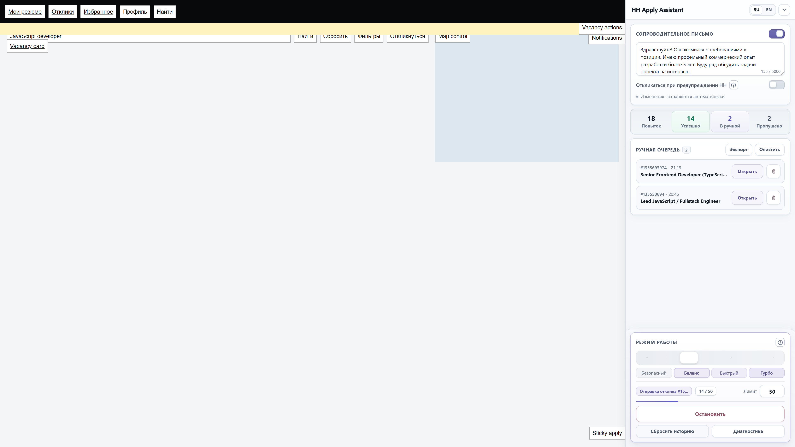

# HH Apply Assistant

[Русский](../../README.md) | [English](README.en.md)

HH Apply Assistant is a browser script for Tampermonkey that automates standard job applications on hh.ru. It adds a side panel to search and vacancy pages, works through the current results page, and saves questionnaires or unconfirmed applications for manual review.

**Install:** [1. Get Tampermonkey](https://www.tampermonkey.net/) → [2. Install HH Apply Assistant](https://raw.githubusercontent.com/tgeruzov/hh-apply-assistant/main/hh-apply-assistant.user.js)

[Detailed installation guide](installation.en.md) · [User guide](usage.en.md) · [Troubleshooting](troubleshooting.en.md)

> [!WARNING]
> This is an independent project and is not affiliated with hh.ru or HeadHunter. Platform rules and limits can change, and automation may lead to CAPTCHA challenges, temporary restrictions, or an account block. You are responsible for how you use the script and for the resulting risks.

## What it does

- processes vacancies that have not yet been handled on the current search page;
- supports standard application forms and cover letters, and verifies successful submission;
- provides four pacing profiles: **Safe**, **Balanced**, **Fast**, and **Turbo**;
- limits confirmed applications per run and shows progress statistics;
- stores questionnaires, reject warnings, and unclear outcomes in a manual queue;
- provides local diagnostics with search, filters, metrics, **Check page**, and report export;
- includes Russian and English UI;
- continues across hh.ru page changes and prevents a second run in another tab;
- stops on CAPTCHA or when it cannot save state reliably.

Changes to hh.ru pages or application steps can require a compatibility update.

## Interface

On wide screens, the panel is docked to the right of hh.ru. In a narrower window it becomes compact, then opens over the page. Collapsing the panel does not stop an active run.

### Interface Screenshots & Modes

- **Compact dock and manual queue:** [02-dock-compact.png](../assets/screenshots/02-dock-compact.png)
- **Diagnostic log in overlay mode:** [03-overlay-mobile.png](../assets/screenshots/03-overlay-mobile.png)
- **Turbo mode with active dynamic indication:** [04-turbo-mode-active.png](../assets/screenshots/04-turbo-mode-active.png)
- **Empty queue state with vector icon:** [05-queue-empty-and-populated.png](../assets/screenshots/05-queue-empty-and-populated.png)
- **Interactive pacing help popover (English localization):** [06-popover-help-i18n.png](../assets/screenshots/06-popover-help-i18n.png)

## Installation

The supported installation path is desktop Chrome with a current Tampermonkey release.

1. Install [Tampermonkey](https://www.tampermonkey.net/).
2. In Chrome 138 or newer, open Tampermonkey's extension details and enable **Allow User Scripts**.
3. Allow Tampermonkey to work on hh.ru and check for updates. The [detailed guide](installation.en.md) covers restricted site access.
4. Open [HH Apply Assistant](https://raw.githubusercontent.com/tgeruzov/hh-apply-assistant/main/hh-apply-assistant.user.js) and confirm the installation.
5. Open **Tampermonkey → Dashboard** and make sure HH Apply Assistant is enabled.
6. Sign in to hh.ru, open [vacancy search](https://hh.ru/search/vacancy), and reload the page. The HH Apply Assistant panel should appear on the right.

Chrome versions older than 138 use the global **Developer mode** toggle as a legacy way to enable user scripts. Tampermonkey checks for HH Apply Assistant updates after they are published to `main`; the detailed guide also covers manual installation.

## Quick start

1. Configure an hh.ru search and open the result page you want to process.
2. Select a pacing profile. **Balanced** is the default; the initial limit is 50 and cover letters are enabled.
3. Review the letter text. By default, the assistant does not continue past an hh.ru warning that an application is likely to be rejected.
4. Click **Start applying**. The limit counts only applications whose submission was confirmed during this run.
5. Watch the status, **Manual queue**, and **Diagnostics**. Click **Stop** to end the run.

The list of vacancies already handled stays with the current browser tab and is not reset when you start again. The script does not advance to the next results page automatically.

## Limits and local data

- Employer questionnaires are not completed automatically.
- CAPTCHA is not bypassed. Automation stops until you solve it and start again.
- An ambiguous or missing confirmation is never counted as a successful send.
- Settings, cover-letter text, the manual queue, and diagnostics stay in browser storage on hh.ru. The project has no server that receives this data.
- A diagnostic report can include page addresses, browser information, logs, and short pieces of page text. Review and redact it before sharing.

See the [privacy notes](PRIVACY.en.md) for details.

## Documentation

- [Installation and updates](installation.en.md)
- [Using the assistant](usage.en.md)
- [Troubleshooting](troubleshooting.en.md)
- [Data and privacy](PRIVACY.en.md)
- [Technical and maintainer documentation](../README.md) — Russian

Architecture, lifecycle, storage internals, diagnostics internals, and release procedures are currently maintained in Russian.

## Contributing

There is no build step or npm dependency installation. Local setup, testing, and pull-request requirements are covered in [CONTRIBUTING.en.md](CONTRIBUTING.en.md). Use the [English bug report](https://github.com/tgeruzov/hh-apply-assistant/issues/new?template=bug_report_en.yml) or [feature request](https://github.com/tgeruzov/hh-apply-assistant/issues/new?template=feature_request_en.yml) form, and follow the [Security Policy](SECURITY.en.md) for vulnerabilities.

## License

HH Apply Assistant is licensed under the [GNU General Public License v3.0 only](../../LICENSE), SPDX: `GPL-3.0-only`.
