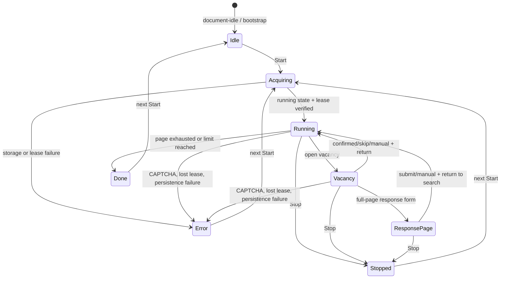

# Lifecycle

Runtime сочетает полный переход между страницами hh.ru, SPA-перерисовки и восстановление из bfcache. Session state связывает новые documents одной вкладки, а generation guards не дают старым async continuations продолжить работу после Stop или takeover.

Диаграмма показывает пользовательские состояния. Навигация создаёт новый runtime, но `is_active` может оставить run логически активным до resume.

## Initial load

Metadata использует `@run-at document-idle`. В начале файл проверяет `window.__hhApplyAssistantV4Runtime`; если в текущем document уже есть active runtime, повторная инъекция завершается без второго watchdog и listener set.

До `bootstrap()` код:

- загружает/нормализует settings и язык;
- создаёт или читает `TAB_ID` из sessionStorage;
- инициализирует state/diagnostics;
- корректирует limit, если persisted sent count оказался выше него;
- пишет page-load log и запускает watchdog с интервалом 1 секунда.

Если `body` ещё нет, MutationObserver ждёт его появления. Затем монтируется UI. Watchdog восстанавливает панель, если SPA удалил её из DOM, даже когда run не активен.

## Fresh Start

Start игнорируется, если loop уже активен. Для нового запуска:

1. `currentRunId` увеличивается до первого `await`.
2. Создаётся AbortController, снимается stop signal.
3. `is_active=1` записывается и перечитывается.
4. Создаётся новый `leaseId`, запись instance lock проверяется через 60 мс.
5. Если это не resume, сбрасываются `sent_count` и `run_stats`. `processed_ids` не сбрасывается.

Потеря актуальности во время lease acquire завершает старую попытку. Занятый lease другой вкладки переводит UI в error/busy state и снимает локальный running flag.

## Search loop

На поисковой странице loop ждёт apply buttons до 2 секунд, читает processed history и отбрасывает hidden/processed targets. Перед каждой вакансией проверяется limit и продлевается lease.

Если SPA удалил выбранную кнопку, выполняется bounded rescan. Максимум — три rescans для текущего loop. После terminal outcome выбирается следующая карточка либо run завершается со статусом done.

## Vacancy navigation

Перед уходом с выдачи сохраняются return URL, last attempt ID и, если доступен, title вакансии. Новый document видит `is_active=1`.

`bootstrap()` планирует resume через 1,5 секунды и перепроверяет running state в момент timer callback. Stop в этом окне отменяет возобновление. На vacancy page `startLoop()` запускает обработку страницы напрямую и оставляет running state для следующей навигации.

При возврате через bfcache handler `pageshow` отменяет старый AbortController, снимает локальные флаги и запускает новое поколение lease/run.

## Response page и trap lock

На `/applicant/vacancy_response` основной loop отдаёт управление watchdog. Если обнаружены `task_*` fields или `startedWithQuestion=true`, страница считается questionnaire и сохраняется в Manual Queue.

Обычная full-page response form обрабатывается `submitResponsePage()`. Перед входом watchdog создаёт trap lock с token, `runId` и default TTL 45 секунд. Token не позволяет старому timer удалить новую блокировку. Повторный watchdog tick не запускает второй handler, пока active response handler или trap существуют.

После подтверждённого отправления или сохранённой ручной записи выставляется reload flag и выполняется возврат. Watchdog перезагружает страницу только после фактического появления search list. На уходе со response path trap очищается.

## Stop

Stop увеличивает `currentRunId`, выставляет stop signal, отменяет resume timer и AbortController, очищает trap, снимает loop/response flags, удаляет `is_active` и освобождает только своё поколение instance lease.

Interruptible waits реагируют на AbortSignal. Даже если старый promise завершится позднее, `runId` и commit guard блокируют запись результата или submit.

## Terminal states

- **Done:** текущая страница исчерпана или достигнут limit.
- **Stopped:** пользователь нажал Stop либо остановка произошла в активном flow.
- **CAPTCHA:** running state, trap и lease снимаются; автоматического resume после решения нет.
- **Lost lease:** текущая вкладка останавливается, чужой lock не удаляется.
- **Persistence error:** fail-closed остановка для критической state/manual write.
- **Unhandled engine error:** `finalizeRun` очищает активность и показывает error.

Terminal status хранится в памяти UI, а `is_active` удаляется. При SPA remount status восстанавливается; если старый UI state говорил running, но storage уже inactive, показывается idle.

## Teardown и закрытие вкладки

`teardownRuntime()` отменяет timers/observers/listeners, уничтожает UI, очищает running state и освобождает своё поколение lease. Обычные `beforeunload`/`unload` не снимают lease во время активной full-page navigation: он должен пережить переход до resume. Если вкладка закрыта посреди run, stale lease перестаёт быть активным через 30 секунд.

`pagehide`, `beforeunload` и `unload` синхронно flush diagnostic log и metrics насколько позволяет браузер.
